# LLM-D Conformance Test Framework — Architecture Guide

This document provides a comprehensive overview of the test framework architecture, test case topologies, deployment modes, and component interactions. All diagrams use Mermaid syntax.

---

## Table of Contents

- [Framework Overview](#framework-overview)
- [9-Phase Test Lifecycle](#9-phase-test-lifecycle)
- [Package Architecture](#package-architecture)
- [Test Case Topologies](#test-case-topologies)
  - [1. Single-GPU Smoke](#1-single-gpu-smoke)
  - [2. Single-GPU](#2-single-gpu)
  - [3. Single-GPU No-Scheduler](#3-single-gpu-no-scheduler)
  - [4. Cache-Aware](#4-cache-aware)
  - [5. Prefill/Decode (P/D)](#5-prefilldecode-pd)
  - [6. P/D + Cache-Aware](#6-pd--cache-aware)
  - [7. Mixture of Experts (MoE)](#7-mixture-of-experts-moe)
  - [8. Multi-Pool](#8-multi-pool)
- [Deployment Modes](#deployment-modes)
  - [Mock Mode](#mock-mode)
  - [Model Sources](#model-sources)
  - [Discover Mode](#discover-mode)
- [Platform Differences](#platform-differences)
- [Manifest Patching Pipeline](#manifest-patching-pipeline)
- [Metrics Validation Matrix](#metrics-validation-matrix)
- [Suggested Improvements](#suggested-improvements)

---

## Framework Overview

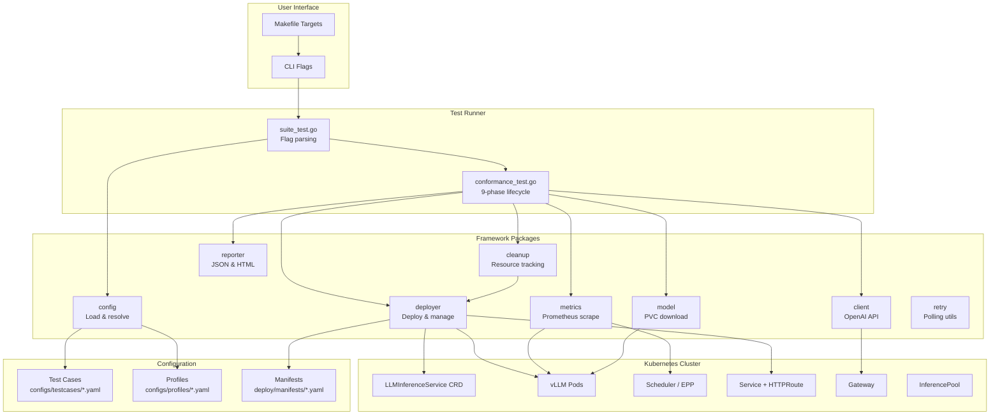

---

## 9-Phase Test Lifecycle

Each test case follows this ordered sequence. A failure in any phase skips all subsequent phases.

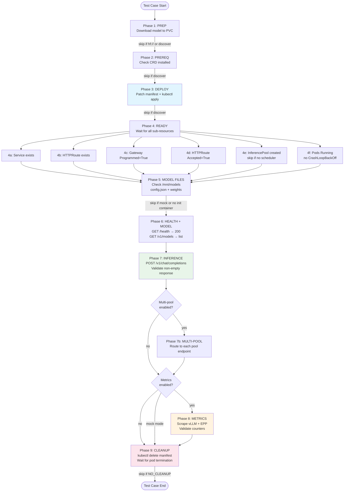

### Phase Details

| Phase | Timeout | Skip Conditions |
|-------|---------|----------------|
| 1. PREP | 90m (configurable) | `hf://` source, discover mode, cache mode |
| 2. PREREQ | 30s | discover mode |
| 3. DEPLOY | 2m | discover mode |
| 4. READY | 10-90m (per test case) | discover mode |
| 5. MODEL FILES | 30s | mock mode, no storage-initializer |
| 6. HEALTH | 2m (retries) | — |
| 7. INFERENCE | 2m per prompt | — |
| 7b. MULTI-POOL | 2m per pool | only if `multiPool.enabled` |
| 8. METRICS | 2m | mock mode, `metricsCheck.enabled=false` |
| 9. CLEANUP | 2m | `NO_CLEANUP=1`, discover mode |

---

## Package Architecture

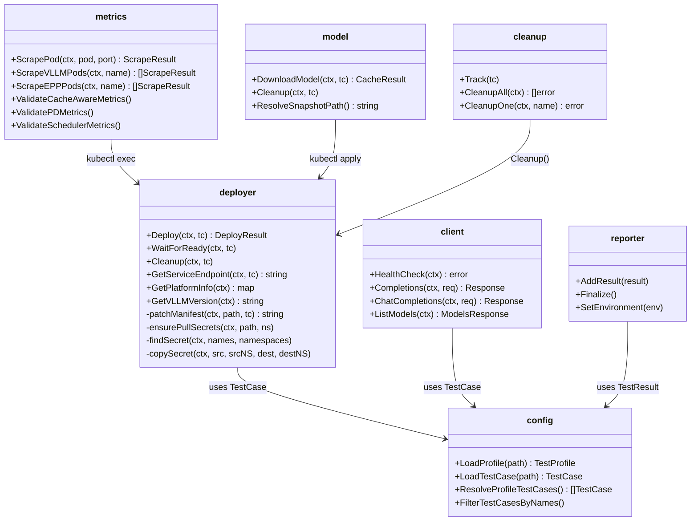

---

## Test Case Topologies

### 1. Single-GPU Smoke

**Purpose:** Fast baseline validation — confirms framework + scheduler work.

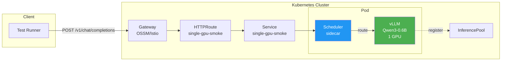

| Property | Value |
|----------|-------|
| Replicas | 1 |
| GPUs | 1 |
| Scheduler | Yes (EPP sidecar) |
| Metrics | Disabled (smoke) |
| Prompts | 1 chat prompt |
| Ready Timeout | 10m |

---

### 2. Single-GPU

**Purpose:** Full baseline with metrics validation — vLLM + EPP + scheduler metrics.

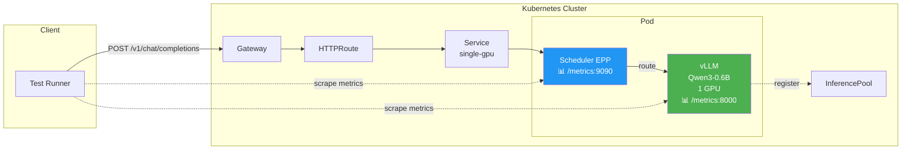

| Property | Value |
|----------|-------|
| Replicas | 1 |
| GPUs | 1 |
| Scheduler | Yes |
| Metrics | vLLM ✓  EPP ✓  Scheduler ✓ |
| Prompts | 2 chat prompts |

---

### 3. Single-GPU No-Scheduler

**Purpose:** Validates K8s native load balancing without LLM-D scheduler. No InferencePool.

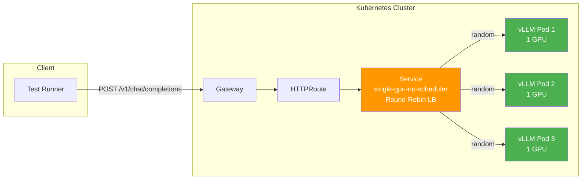

| Property | Value |
|----------|-------|
| Replicas | 3 |
| GPUs | 3 total |
| Scheduler | **No** — K8s Service round-robin |
| InferencePool | **No** |
| Metrics | Disabled |

---

### 4. Cache-Aware

**Purpose:** Validates prefix KV cache-aware routing — scheduler routes requests with same system prefix to the same pod for cache reuse.

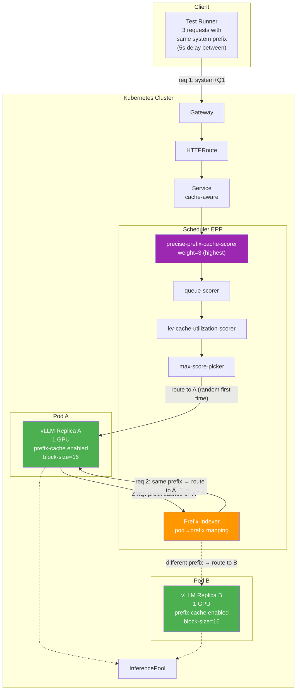

**Cache-Aware Request Flow:**

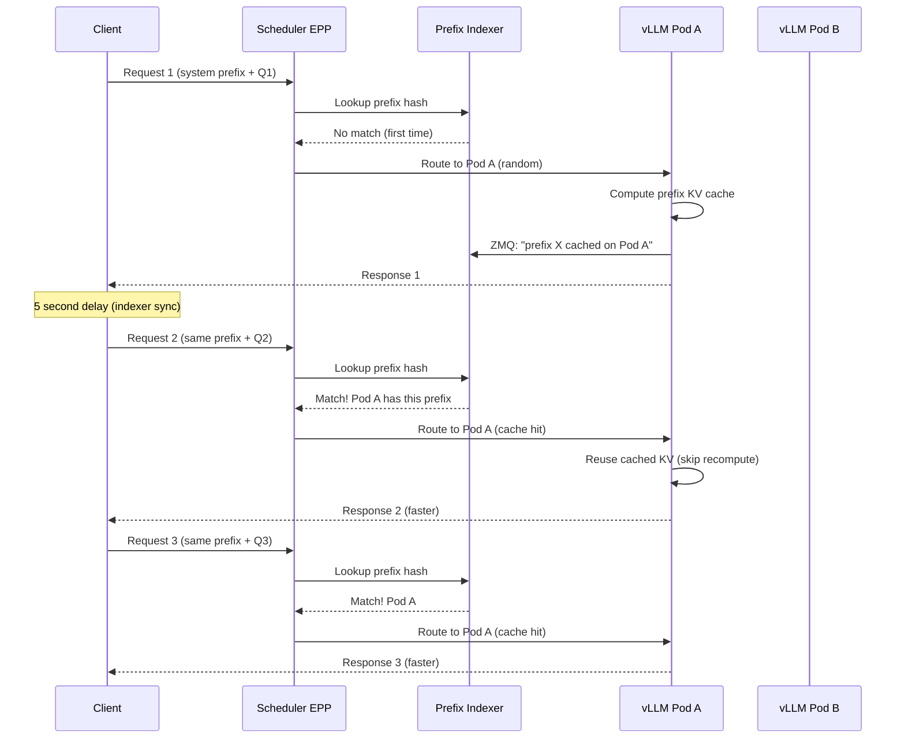

| Property | Value |
|----------|-------|
| Replicas | 2 |
| GPUs | 2 total |
| Scheduler | Yes — prefix-cache-scorer (weight=3) |
| Key Config | `block-size=16`, `hash-algo=sha256` |
| ZMQ | vLLM → EPP (prefix cache events) |
| Prompts | 3 chat prompts, same system prefix, 5s delay |
| Metrics | vLLM ✓  EPP ✓  Scheduler ✓  PrefixCache ✓ |

---

### 5. Prefill/Decode (P/D)

**Purpose:** Validates P/D disaggregation — prefill pods compute KV cache, transfer via NIXL to decode pod for token generation.

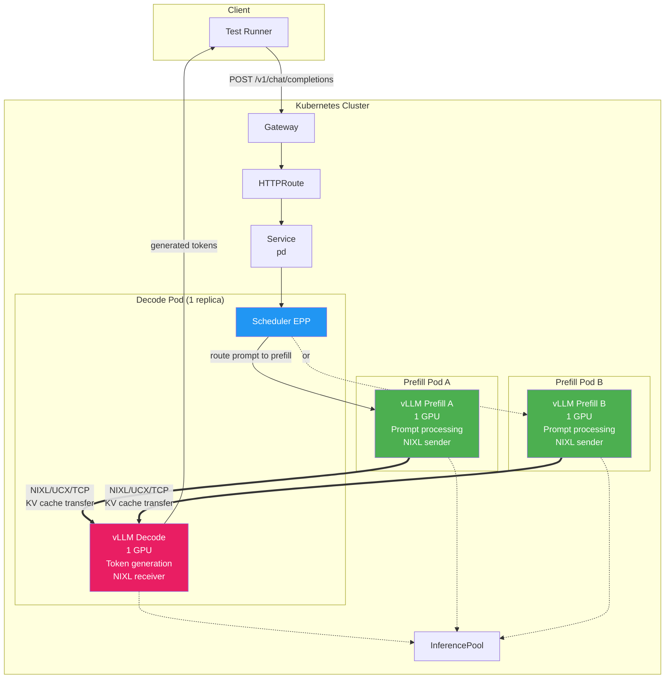

**P/D Request Flow:**

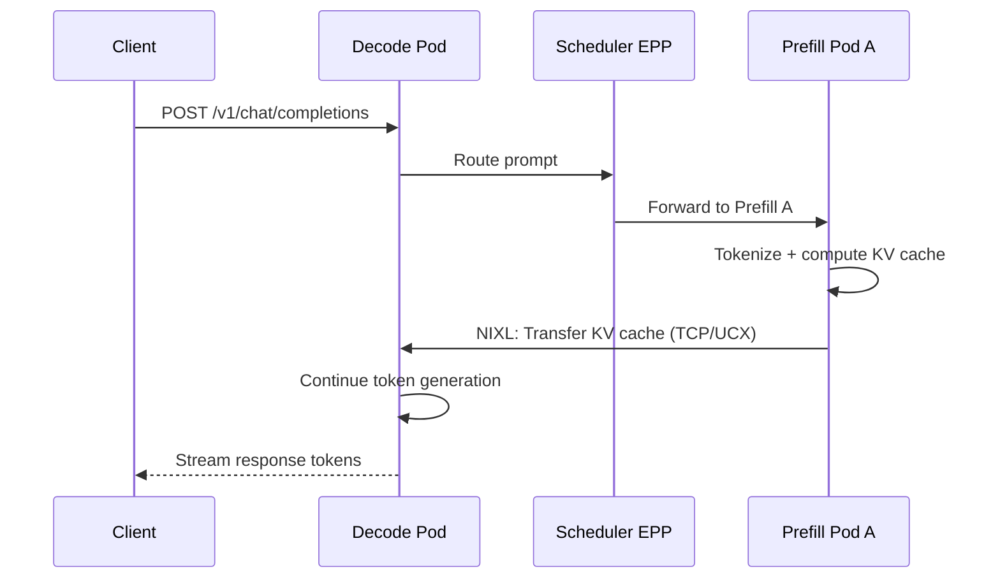

| Property | Value |
|----------|-------|
| Decode Replicas | 1 |
| Prefill Replicas | 2 |
| GPUs | 3 total (1 decode + 2 prefill) |
| KV Transfer | NIXL over TCP/UCX |
| Scheduler | Yes — routes prompts to prefill pods |
| Metrics | vLLM ✓  PD ✓  NIXL ✓  Scheduler ✓ |

---

### 6. P/D + Cache-Aware

**Purpose:** Most complex topology — combines P/D disaggregation with prefix cache-aware routing. Scheduler routes to the prefill pod that already has the prefix cached.

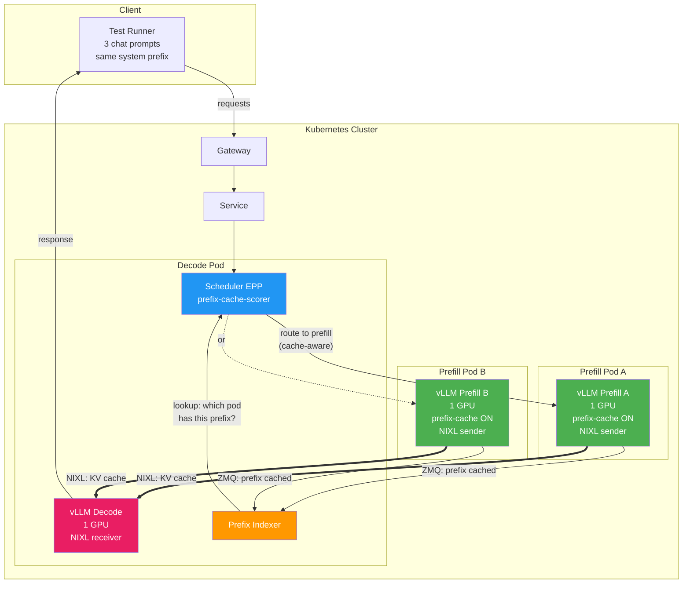

**Combined Flow:**

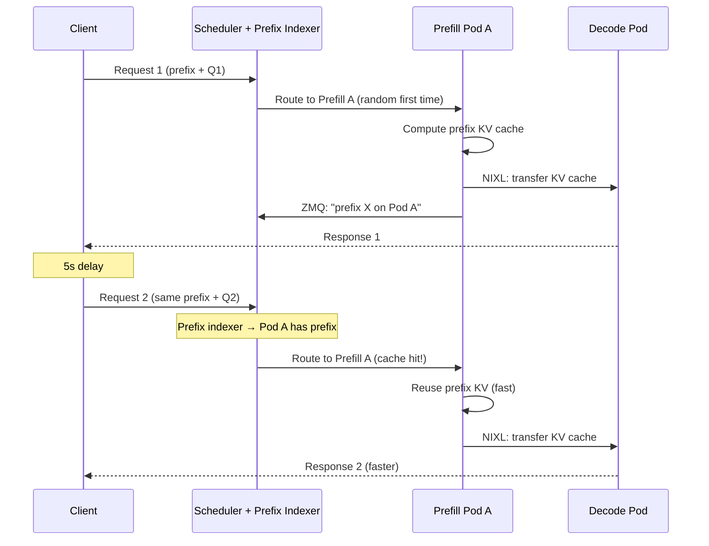

| Property | Value |
|----------|-------|
| Decode Replicas | 1 |
| Prefill Replicas | 2 |
| GPUs | 3 total |
| KV Transfer | NIXL over TCP/UCX |
| Prefix Cache | Yes — on prefill pods |
| ZMQ Events | Prefill → EPP (cache state) |
| Metrics | **All**: vLLM, PD, NIXL, EPP, Scheduler, PrefixCache |

---

### 7. Mixture of Experts (MoE)

**Purpose:** Validates distributed MoE inference with expert/tensor parallelism across multi-GPU nodes connected via RoCE/InfiniBand.

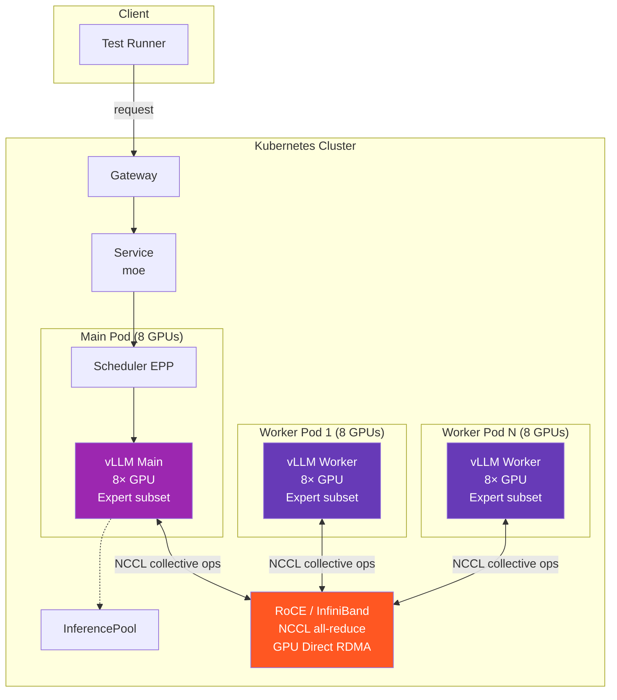

| Property | Value |
|----------|-------|
| Model | DeepSeek-R1-0528 |
| GPUs | 8 per pod (main + N workers) |
| Parallelism | data=32, expert=true, tensor=1 |
| Network | RoCE/IB (NCCL, NVSHMEM, UCX) |
| Storage | 500Gi PVC |
| Ready Timeout | 90m |
| Metrics | vLLM ✓  Scheduler ✓ |

---

### 8. Multi-Pool

**Purpose:** Validates multiple independent InferencePools sharing a single Gateway — tests VirtualService merge (OSSM-12585 fix).

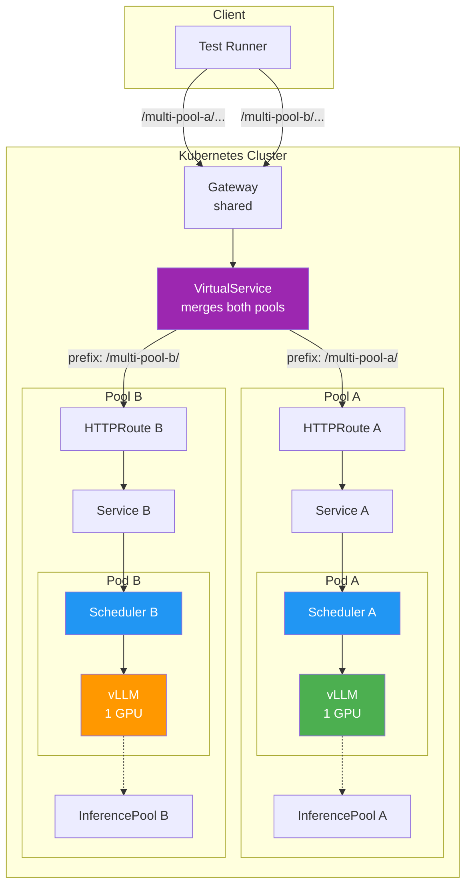

| Property | Value |
|----------|-------|
| Pools | 2 (multi-pool-a, multi-pool-b) |
| GPUs | 2 total (1 per pool) |
| Schedulers | 2 (independent per pool) |
| Routing | VirtualService prefix-based |
| Validates | OSSM-12585 multi-pool merge |

---

## Deployment Modes

### Mock Mode

Replaces vLLM containers with a lightweight mock server — no GPU, no model download. The scheduler, EPP, and InferencePool remain real.

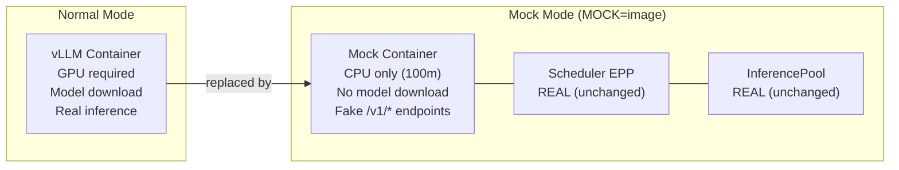

**What changes in mock mode:**

| Component | Normal | Mock |
|-----------|--------|------|
| vLLM image | `vllm/vllm:latest` | Mock image |
| GPU | Required | Not needed |
| CPU/Memory | 4 CPU, 32Gi | 100m CPU, 64Mi |
| storageInitializer | Downloads model | Disabled |
| Scheduler/EPP | Real | **Real** (unchanged) |
| InferencePool | Real | **Real** (unchanged) |
| Phase 5 (model files) | Checked | Skipped |
| Phase 8 (metrics) | Scraped | **Skipped** |
| Prefill pods (P/D) | Real vLLM | **Mock** (both replaced) |

**Usage:**
```bash
make test TESTCASE=single-gpu MOCK=ghcr.io/aneeshkp/vllm-mock:latest
make test-profile-all MOCK=ghcr.io/aneeshkp/vllm-mock:latest  # all topologies
```

---

### Model Sources

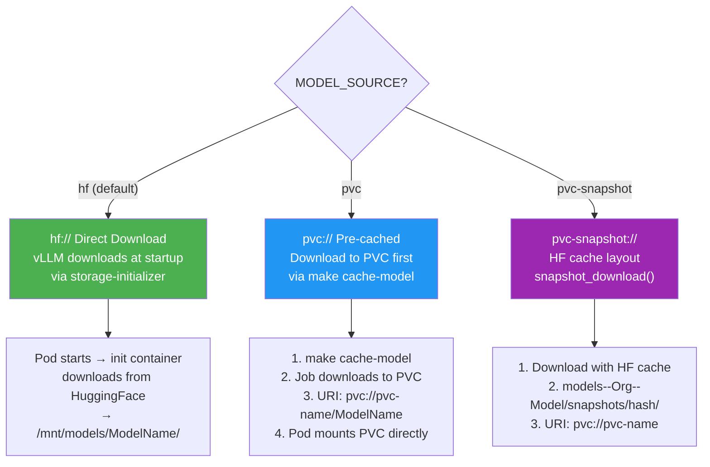

---

### Discover Mode

Validates an existing deployment without deploying or cleaning up.

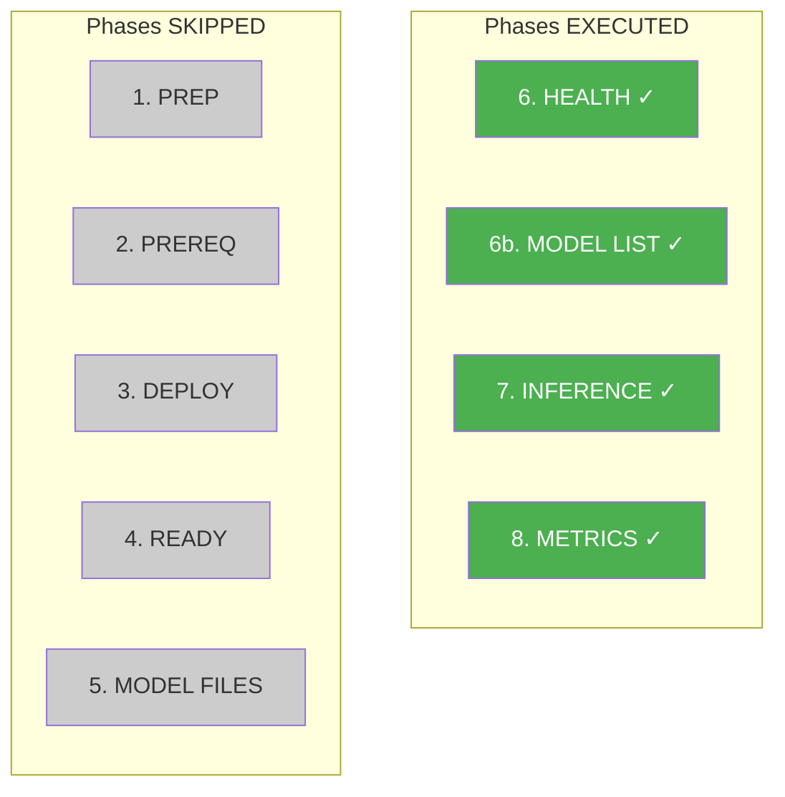

**Usage:**
```bash
make test TESTCASE=single-gpu DISCOVER=true NAMESPACE=my-existing-ns
```

---

## Platform Differences

| Feature | OCP | AKS | GKS |
|---------|-----|-----|-----|
| CLI tool | `oc` (preferred) | `kubectl` | `kubectl` |
| Pull secrets | Global (skipped) | Copied from source NS | Copied from source NS |
| Auth disable | Annotation injection | Annotation injection | Annotation injection |
| Gateway discovery | `opendatahub`, `istio-system` | `kserve`, `istio-system` | `kserve`, `istio-system` |
| Storage default | RWO | Azure Disk (RWO) | Persistent Disk (RWO) |
| Multi-replica PVC | RWX via NFS | `azurefile-csi-premium` | Custom StorageClass |

---

## Manifest Patching Pipeline

Every manifest goes through this transformation pipeline before `kubectl apply`:

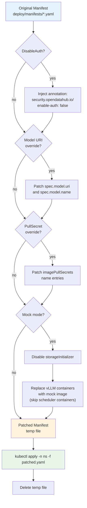

---

## Metrics Validation Matrix

Which metrics are checked per test case topology:

| Metric | Smoke | Single | No-Sched | Cache | P/D | P/D+Cache | MoE | Multi |
|--------|:-----:|:------:|:--------:|:-----:|:---:|:---------:|:---:|:-----:|
| `vllm:request_success_total` | — | ✓ | — | ✓ | ✓ | ✓ | ✓ | ✓ |
| `vllm:prompt_tokens_total` | — | ✓ | — | — | ✓ | ✓ | ✓ | ✓ |
| `vllm:generation_tokens_total` | — | ✓ | — | — | ✓ | ✓ | ✓ | ✓ |
| `vllm:gpu_cache_usage_perc` | — | ✓ | — | ✓ | — | ✓ | — | ✓ |
| `vllm:prefix_cache_queries` | — | — | — | ✓ | — | ✓ | — | — |
| `vllm:prefix_cache_hits` | — | — | — | ✓ | — | ✓ | — | — |
| `prefix_cache_hit_rate` | — | — | — | ✓ | — | ✓ | — | — |
| `nixl:kv_transfer_count` | — | — | — | — | ✓ | ✓ | — | — |
| `nixl:kv_transfer_failures` | — | — | — | — | ✓ | ✓ | — | — |
| `scheduler_e2e_duration` | — | ✓ | — | ✓ | ✓ | ✓ | ✓ | ✓ |
| `request_total` | — | ✓ | — | ✓ | ✓ | ✓ | ✓ | ✓ |
| `request_error_total` | — | ✓ | — | ✓ | ✓ | ✓ | ✓ | ✓ |
| `pool_ready_pods` | — | ✓ | — | ✓ | ✓ | ✓ | ✓ | ✓ |
| `prefix_indexer_size` | — | — | — | ✓ | — | ✓ | — | — |

---

## Suggested Improvements

### High Priority

| # | Improvement | Impact |
|---|-------------|--------|
| 1 | **Increase deployer test coverage** (19% → 60%+) | Catch manifest patching edge cases |
| 2 | **Pre-flight `kubectl apply --dry-run=client`** | Fail fast on invalid manifests |
| 3 | **Per-phase configurable timeouts** in test case YAML | Different clusters need different timeouts |
| 4 | **Labeled break in loops** and better error context | Easier debugging |

### Medium Priority

| # | Improvement | Impact |
|---|-------------|--------|
| 5 | **Test parallelism** with per-test namespaces | 2h → 30m runtime |
| 6 | **Separate download timeout** from ready timeout | Large models need 2h+ download |
| 7 | **Pre-flight cluster checks** (node capacity, GPU availability) | Fail fast on capacity issues |
| 8 | **Extract magic numbers** (ports, labels, timeouts) to constants | Maintainability |

### Low Priority

| # | Improvement | Impact |
|---|-------------|--------|
| 9 | **Plugin system** for custom validators | Extensibility |
| 10 | **Performance tracking** (latency trends over time) | Regression detection |
| 11 | **Manifest versioning** (v1, v2 patching strategies) | Backwards compatibility |
| 12 | **Per-test namespace isolation** | Prevent state leakage |

---

## Quick Reference

### Common Commands

```bash
# Setup
make setup                              # Clone manifests (main branch)
make setup MANIFEST_REF=3.4-ea2         # Clone specific branch
make manifests                          # List available branches

# Run tests
make test TESTCASE=single-gpu           # Single test case
make test TESTCASE=single-gpu,pd        # Multiple test cases
make test-profile-all                   # All conformance tests

# Mock mode (no GPU)
make test TESTCASE=single-gpu MOCK=ghcr.io/aneeshkp/vllm-mock:latest
make test-profile-all MOCK=ghcr.io/aneeshkp/vllm-mock:latest

# Validate existing deployment
make test TESTCASE=single-gpu DISCOVER=true NAMESPACE=my-ns

# Cache model to PVC
make cache-model TESTCASE=single-gpu STORAGE_CLASS=azurefile-rwx

# Debug (keep resources)
make test TESTCASE=pd NO_CLEANUP=1

# Unit tests
make unittest

# Discovery
make profiles                           # List test profiles
make testcases                          # List test cases
make models                             # List models
```

### File Layout

```
├── configs/
│   ├── testcases/          # 8 test case definitions
│   │   ├── single-gpu-smoke.yaml
│   │   ├── single-gpu.yaml
│   │   ├── single-gpu-no-scheduler.yaml
│   │   ├── cache-aware.yaml
│   │   ├── pd.yaml
│   │   ├── pd-cache-aware.yaml
│   │   ├── moe.yaml
│   │   └── multi-pool.yaml
│   └── profiles/           # 5 test profiles
│       ├── smoke.yaml
│       ├── all.yaml
│       ├── cache-aware.yaml
│       ├── pd.yaml
│       └── deepseek.yaml
├── deploy/manifests/       # Cloned from manifest repo (gitignored)
├── framework/
│   ├── cleanup/            # Resource lifecycle tracking
│   ├── client/             # OpenAI-compatible API client
│   ├── config/             # YAML config loading (95% coverage)
│   ├── deployer/           # K8s deployment management (31% coverage)
│   ├── metrics/            # Prometheus scraping (71% coverage)
│   ├── model/              # Model download & PVC caching
│   ├── reporter/           # JSON & HTML reporting
│   └── retry/              # Polling utilities
├── tests/
│   ├── conformance_test.go # 9-phase test lifecycle (1400+ lines)
│   ├── suite_test.go       # Ginkgo suite + CLI flags
│   └── smoke/              # Framework validation (no cluster)
├── docs/
│   ├── architecture.md     # This document
│   ├── adding-test-cases.md
│   └── disconnected-ocp-setup.md
└── Makefile                # All targets and flag mappings
```
